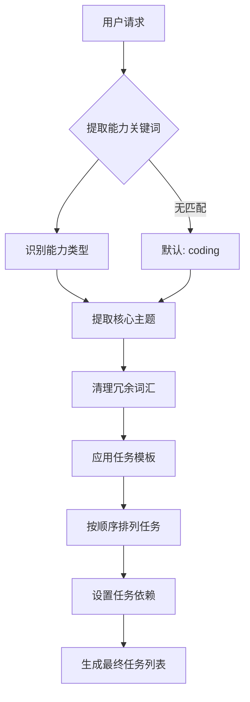

# Agent Orchestrator - 任务分解策略详解

## 📋 概述

Agent Orchestrator 通过智能关键词匹配，将复杂的用户请求分解为多个能力特定的子任务，每个子任务由专门能力的 agent 执行。

## 🔍 能力识别系统

### 六大核心能力

```
┌─────────────┬─────────────┬─────────────┬─────────────┬─────────────┬─────────────┐
│  Research   │   Coding    │   Testing   │    Docs     │     Ops     │    Image    │
│   调研分析   │   开发实现   │   测试验证   │   文档编写   │   运维部署   │   设计绘图   │
└─────────────┴─────────────┴─────────────┴─────────────┴─────────────┴─────────────┘
```

### 关键词映射表

| 能力 | 英文关键词 | 中文关键词 |
|-----|-----------|-----------|
| **research** | research, analy, find, collect | 分析, 调研, 资料, 查找, 收集, 整理 |
| **coding** | code, implement, refactor, fix | 开发, 实现, 重构, 修复, 脚本, 编写, 编程 |
| **testing** | test, pytest, coverage | 测试, 用例, 覆盖率, 回归, 验证 |
| **docs** | doc, readme, documentation | 文档, 说明, 总结, 写文档 |
| **ops** | deploy, monitor, ops | 上线, 监控, 告警, 运维, 部署 |
| **image** | image, poster, design | 图, 海报, 绘图, 设计 |

## 🎯 任务分解流程



### 详细步骤

1. **提取能力** (`_extract_capabilities`)
   ```python
   输入: "编写程序获取 HN 最新 30 条 进行测试 完成 使用文档编写"
   处理: 扫描关键词 → 匹配能力
   输出: ['coding', 'testing', 'docs']
   ```

2. **提取主题** (`_extract_topic`)
   ```python
   输入: "编写程序获取 HN 最新 30 条 进行测试"
   处理: 移除能力关键词 → 清理标点
   输出: "获取 HN 最新 30 条"
   ```

3. **生成任务** (`_decompose_request`)
   ```python
   输入: 能力列表 + 主题
   处理: 为每个能力应用模板
   输出: 
   - [coding] 实现/开发：获取 HN 最新 30 条
   - [testing] 测试验证：...（包括功能测试、边界条件、错误处理）
   - [docs] 编写使用文档：...（包括安装、配置、使用示例）
   ```

4. **任务排序**
   ```python
   标准顺序: research → coding → testing → docs → ops → image
   ```

## 📝 任务模板系统

### 模板定义

```python
CAPABILITY_TASK_TEMPLATES = {
    "research": "进行资料调研与分析：{topic}",
    "coding": "实现/开发：{topic}",
    "testing": "测试验证：{topic}（包括功能测试、边界条件、错误处理）",
    "docs": "编写使用文档：{topic}（包括安装、配置、使用示例）",
    "ops": "运维部署：{topic}",
    "image": "设计/绘图：{topic}",
}
```

### 模板应用示例

**请求**: "开发用户认证模块"

| 能力 | 模板 | 生成任务 |
|-----|------|---------|
| coding | `实现/开发：{topic}` | 实现用户认证模块 |
| testing | `测试验证：{topic}（包括...）` | 测试验证：用户认证模块（包括功能测试、边界条件、错误处理） |
| docs | `编写使用文档：{topic}（包括...）` | 编写使用文档：用户认证模块（包括安装、配置、使用示例） |

## 🧪 实战案例

### 案例 1: 单能力任务

```bash
请求: "访问molt网站获取最火热帖子的内容和讨论信息，分析整理后生成一篇技术博客文章"

分解过程:
1. 关键词匹配: "分析" → research
2. 提取主题: "访问molt网站获取最火热帖子的内容和讨论信息，生成技术博客文章"
3. 应用模板: "进行资料调研与分析：{主题}"

结果:
✅ Task 1: [research] 进行资料调研与分析：访问molt网站获取最火热帖子的内容和讨论信息，分析整理后生成一篇技术博客文章
```

### 案例 2: 多能力流水线

```bash
请求: "编写程序获取 Hacker News 最新 30 条信息 进行测试 完成 使用文档编写"

分解过程:
1. 关键词匹配: "编写程序" → coding, "测试" → testing, "文档" → docs
2. 识别能力: ['coding', 'testing', 'docs']
3. 为每个能力生成独立任务

结果:
✅ Task 1: [coding] 编写程序获取 Hacker News 最新 30 条信息
✅ Task 2: [testing] 测试验证：...（包括功能测试、边界条件、错误处理）
✅ Task 3: [docs] 编写使用文档：...（包括安装、配置、使用示例）
```

### 案例 3: 运维任务

```bash
请求: "部署应用到生产环境，配置监控告警"

分解过程:
1. 关键词匹配: "部署" → ops, "监控" → ops
2. 去重: ['ops']
3. 应用模板

结果:
✅ Task 1: [ops] 运维部署：部署应用到生产环境，配置监控告警
```

### 案例 4: 默认行为

```bash
请求: "帮我处理这个数据"

分解过程:
1. 关键词匹配: 无匹配
2. 默认能力: ['coding']
3. 应用模板

结果:
✅ Task 1: [coding] 实现功能
```

## 🔧 智能特性

### 自动清理

系统会自动清理任务描述中的冗余信息：

```python
原始: "编写程序获取 HN 最新 30 条 进行测试 完成 使用文档编写"
清理: "获取 HN 最新 30 条"

清理规则:
- 移除能力关键词
- 移除标点符号（,，、；;和与及）
- 移除连接词（然后、再、接着、之后）
- 压缩空白字符
```

### Coding 任务特殊处理

对于 coding 任务，系统会移除 testing 和 docs 相关的描述：

```python
原始: "开发用户认证模块，进行单元测试，编写API文档"
→ [coding] 开发用户认证模块  # 只保留开发部分
```

## 📊 任务依赖模式

### Single 模式
```
所有任务 → 合并为 1 个 → 由单个 agent 完成
```

### Linear 模式
```
Task 1 → Task 2 → Task 3 → Task N
顺序执行，每个任务依赖前一个
```

### DAG 模式
```
支持复杂的依赖关系图
Task 1 ──┬──→ Task 3
         │
Task 2 ──┴──→ Task 4
```

### Debate 模式
```
多个 agents 并行讨论和评审
┌──→ Agent A ──┐
│              │
├──→ Agent B ──┼──→ 汇总结果
│              │
└──→ Agent C ──┘
```

## 🎨 最佳实践

### 1. 明确的能力关键词

✅ **推荐**：
```
"开发用户认证模块，进行单元测试，编写API文档"
→ 明确识别 coding + testing + docs
```

❌ **不推荐**：
```
"做个认证"
→ 太模糊，只能默认为 coding
```

### 2. 合理的任务粒度

✅ **推荐**：
```
"开发认证模块，测试覆盖率>80%"
→ 粒度适中，任务清晰
```

❌ **不推荐**：
```
"开发、测试、部署整个系统"
→ 粒度太粗，需要进一步分解
```

### 3. 主题描述清晰

✅ **推荐**：
```
"获取 Hacker News 最新 30 条新闻"
→ 主题清晰明确
```

❌ **不推荐**：
```
"抓数据"
→ 主题不明确
```

## 📈 统计与优化

### 分解效率

- **单能力任务**: 1 个任务
- **双能力任务**: 2 个任务
- **三能力任务**: 3 个任务（最常见：coding+testing+docs）
- **全流程任务**: 最多 6 个任务（6 种能力）

### 常见模式

| 模式 | 频率 | 示例 |
|-----|------|------|
| coding | 40% | "实现XX功能" |
| coding+testing+docs | 30% | "开发XX，测试，写文档" |
| research | 15% | "调研XX，分析XX" |
| ops | 10% | "部署XX，配置监控" |
| 其他 | 5% | image, 自定义组合 |

## 🚀 高级用法

### 自定义能力标签

可以通过修改 `agent-profiles.json` 为 agent 添加自定义能力标签：

```json
{
  "agents": {
    "my-agent": {
      "tags": ["coding", "ml", "data"],
      "extraDescription": "专门处理机器学习和数据处理任务"
    }
  }
}
```

### 混合能力 Agent

系统优先选择纯能力 agent，如果找不到则使用混合能力 agent：

```
优先级:
1. 纯 coding agent（只有 coding 标签）
2. 混合 agent（有 coding + 其他标签）
```

## 📚 相关文档

- [Agent Orchestrator 主文档](./SKILL.md)
- [数据模型](./references/data-model.md)
- [Agent 配置](/home/ubuntu/.openclaw/data/agent-orchestrator/agent-profiles.json)

## 🔍 调试技巧

### 查看分解结果

```bash
# JSON 格式输出
$AO decompose my-project --json

# 查看识别的能力
$AO status my-project --json | jq '.routing'

# 查看生成的任务
$AO status my-project --json | jq '.plan.tasks'
```

### 测试分解逻辑

```python
from orchestrator import _extract_capabilities, _decompose_request

request = "你的测试请求"
caps = _extract_capabilities(request)
tasks = _decompose_request(request)
print(f"识别能力: {caps}")
for task in tasks:
    print(f"[{task['capability']}] {task['description']}")
```

---

**最后更新**: 2026-02-15  
**版本**: 1.0  
**维护者**: Agent Orchestrator Team
